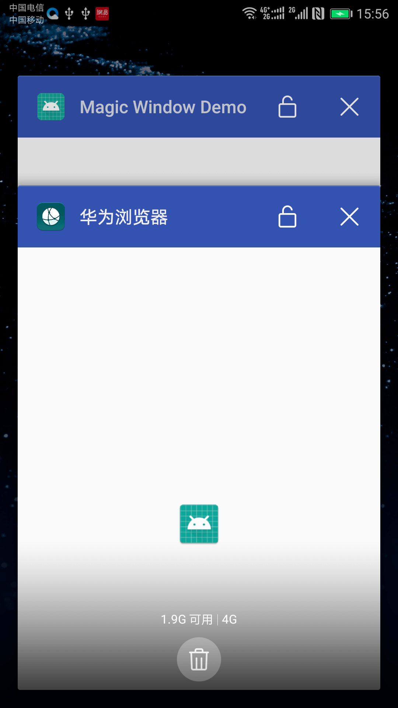

偶然得知魔窗这款产品，其中的`mLink`企业级深度链接解决方案，在当今存在十几款浏览器的 Android 市场下，也是对浏览器跳转 App 提供了很好的兼容

之前也是做过浏览器跳转 App，利用 Scheme 机制，对 Activity 加`intent-fliter`来实现，只不过看到魔窗 mLink 可以在没有安装 App 的情况下，用户下载 App 并打开后，竟然能够复原到具体页面感到好奇，于是好奇心作用下研究了下魔窗的 sdk

<!-- More -->

## 0x00 Android Scheme

Android Scheme 应该都不陌生，类似`zyhang://`这样的格式，在手机浏览器触发这么一段 url，就可以启动对应的 App，当然前提是 App 已安装

```html
<a href="zyhang://">跳转App</a>
```

> 针对未安装 App 的情况下一般做法是跳转下载页，网上也有很多资料

## 0x01 浏览器兼容

然而，当今 Android 市场存在不少于十几款浏览器，每一款浏览器不能保证都是一样的处理 scheme 逻辑，所以也就存在很多奇怪现象的发生

浏览器 scheme 跳转例子如下

```kotlin
val scheme = "zyhang://"
val uri = Uri.parse(scheme)
val intent = Intent(Intent.ACTION_VIEW, uri)
// 各个flag的作用自行搭配
intent.addFlags(Intent.FLAG_ACTIVITY_NEW_TASK or Intent.FLAG_ACTIVITY_CLEAR_TOP)
startActivity(intent)
```

### 坑一：怎么后台进程有两个我的 App



应该是部分浏览器(例如华为浏览器)在处理 scheme 时没有针对 intent 添加`FLAG_ACTIVITY_NEW_TASK`flag，也就导致了 App 页面会在浏览器进程显示

> 针对这一个问题，可以在入口界面根据 intent.data 自行添加 flag 跳转主页之类去处理

### 坑二：百度浏览器跳不了 App

这也是很服的，像微信这种白名单过滤存在利益竞争，但也可以注册微下载通过应用宝去跳转，一个浏览器竟然跳不了，暂时找不到方法绕过

### 坑三：Chrome 跳转 App 会重启页面

包括 UC、QQ 浏览器也会存在这一现象

> 可以给 MainActivity 增加`FLAG_ACTIVITY_SINGLE_TOP`

## 0x02 魔窗复原场景分析

魔窗的 mLink 的浏览器跳转 App 功能也是利用 Android Scheme 机制实现，看上面 ↑，其中比较有趣的是复原场景功能，在下载 App 并打开后能够路由到具体页面，这个功能是 Android Scheme 无法做到的。

> iOS 的 App Store 有这样的功能，依赖于 App Store
> Android 市场混乱，所以魔窗的这套解决方案的确很妙

### 源码分析

实现这一场景复原的功能是由这一句触发的

```kotlin
MLink.getInstance(this).deferredRouter()
```

先看 MLink 初始化源码

```java
private MLink(Context var1) {
        /* 省略 */
        this.onReferral();
    }

private void onReferral() {
        // needGetDPLs 判断时间和是否第一次获取DPLs
        if (this.needGetDPLs()) {
            this.getDPLs();
        }
    }

private void getDPLs() {
        /* 省略 */
        // 请求接口保存DPLs
        StringRequest var3 = new StringRequest(HttpMethod.POST, "https://stats.mlinks.cc/dp/dpls/v2", new h(this));
        var3.setBodyParams(var1);
        HttpFactory.getInstance(MWConfiguration.getContext()).addToRequestQueue(var3);
    }
```

抓个包看到，最下面的`ddl.dp`就是要触发的 scheme


> 后面就是根据这个`ddl.dp`去跳转到具体页面，这就是魔窗能复原场景的原因，这个功能也是挺有用的

抓包过程中发现个问题，拿的是丰趣海淘抓的包，人家用的是旧的 sdk，3.9 版本的，魔窗没用 https，所以丰趣海淘的 scheme 完全暴露，新的魔窗 sdk 就改接口了，不过还没试。比如 scheme 跳 webView 等就存在钓鱼风险了，所以使用还是要留个心眼。

## 0x03 demo

整理了一下，备份下

```xml
<activity android:name=".SplashActivity">
            <intent-filter>
                <action android:name="android.intent.action.MAIN"/>
                <category android:name="android.intent.category.LAUNCHER"/>
            </intent-filter>
            <intent-filter>
                <data
                    android:scheme="zyhang"/>
                <action android:name="android.intent.action.VIEW"/>

                <category android:name="android.intent.category.DEFAULT"/>
                <category android:name="android.intent.category.BROWSABLE"/>
            </intent-filter>
        </activity>
```

```kotlin
class SplashActivity : BaseActivity() {
    override fun onCreate(savedInstanceState: Bundle?) {
        super.onCreate(savedInstanceState)
        setContentView(R.layout.activity_splash)

        if (!intent.dataString.isNullOrEmpty()) {
            val intent = Intent(this, MainActivity::class.java)
            intent.addFlags(Intent.FLAG_ACTIVITY_NEW_TASK or Intent.FLAG_ACTIVITY_CLEAR_TOP or Intent.FLAG_ACTIVITY_SINGLE_TOP)
            startActivity(intent)

            // 处理scheme
            xxx

            finish()
        } else {
            startActivity(Intent(this, MainActivity::class.java))
            finish()
        }
    }
}
```
