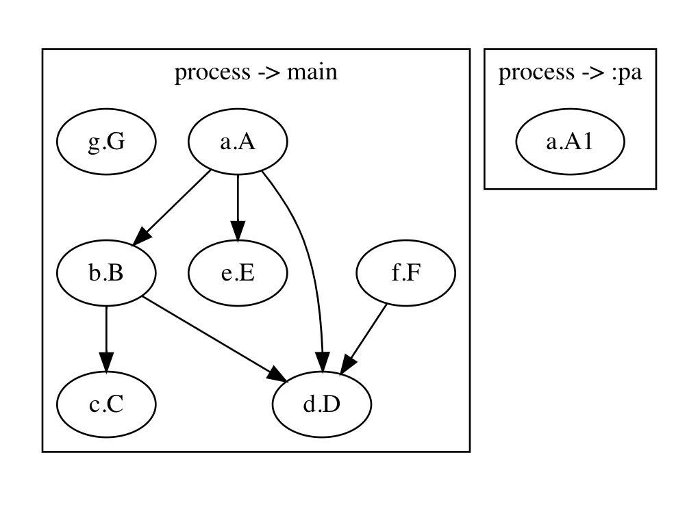

## 前言

在项目模块化后，为了解决模块之间互相依赖问题，通常会引入路由框架，通过路由框架将各个模块联系到一起。模块化后各个模块还可以独立运行，这时会有这样一个问题，当模块有各自的初始化任务（比如用户信息），通常会把这些初始化任务放在 Application#onCreate 方法进行初始化，当只编译一个模块时，其他模块的初始化任务有可能不需要执行，这时就只能新建一个 Application 或者抽离或者注释... 本方案就是为了解决这一现象而提出，还能解放 Application，使 Application 简洁明了

<!-- More -->

## 痛点分析

1. 项目启动任务数量与业务、模块的增加成正比，这也导致 Application 越加臃肿
2. 许多启动任务并不需要即时加载，通常做法也只是 post 到首页加载后
3. 模块化后，模块启动任务之间的依赖关系难以处理

针对1，谷歌官方在 androidx 上也推行了一款[启动框架](https://developer.android.com/topic/libraries/app-startup)，通过向 provider 注册任务来解放 Application，但该框架实现相对简单，功能较少，但也对我启发不少

针对2，我希望启动任务不仅仅只是延迟到首页显示后执行，而是希望启动任务能并行执行，并且由框架计算出最优执行顺序

针对3，模块的启动任务由模块自行声明，通过类似路由的id指向依赖任务，并且框架在编译期间能够校验启动任务的合法性以及输出依赖关系图，辅助开发者分析启动任务链

## 开发

有了分析和解决路线，就开始着手开发

### 解决模块问题

模块问题的解决思路与路由框架一致，由于模块之间不允许互相依赖，所以有了许多路由框架的诞生。

首先是声明注解

```kotlin
annotation class StartupTaskRegister(
    val id: String, // 任务唯一id
    val idDependencies: Array<String>, // 所依赖的任务id
)
```

其后就是声明注解处理器

```kotlin
class StartupProcessor : AbstractProcessor() {
    /* 
    拿到使用 StartupTaskRegister 注解的 StartupTask
    一一对应生成 STData 文件，最终 App 启动的任务类
     */
}
```

最后通过 Transform 插件，将这些 STData 收集并生成任务注册文件 StartupLoaderInit.class

```java
public class StartupLoaderInit {
    public static void init(StartupCore var0) {
        var0.register(new B__STData());
        var0.register(new G__STData());
        var0.register(new A1__STData());
        var0.register(new F__STData());
        var0.register(new E__STData());
        var0.register(new D__STData());
        var0.register(new C__STData());
        var0.register(new A__STData());
    }
}
```

App 启动时，通过反射调用 StartupLoaderInit#init 方法，向框架注册启动任务，框架进行任务排序并依次启动

### 启动任务并行以及阻塞

启动任务需要且不仅仅只是异步执行，更需要支持阻塞启动线程。

例如有启动任务A、B、C，A和B需要同时执行，C在A后，并且C需要在首页加载前执行。如果A和B只单纯放在新线程执行，那C将不能保证在首页加载前执行，此时需要阻塞启动线程，等待C完成后释放

这一功能是通过使用 CountDownLatch 来实现，每个启动任务都会声明一个 CountDownLatch，个数为其依赖的数量

```kotlin
CountDownLatch(idDependencies.size)
```

在执行前等待依赖完成

```kotlin
// 阻塞，等待父任务完成
countDownLatch.await()
startup()
```

### 任务链排序

框架需要计算出最优的启动任务执行顺序，那就需要对启动任务进行排序，这里用到的是拓扑排序，根据每个启动任务的依赖个数进行入度计算，以此计算出启动任务排序，其中会分为两条启动任务链，同步的和异步的，最终异步的启动任务链会插在同步的启动任务链前生成最终的执行顺序

详情请看 [core/StartuoSort.kt](https://github.com/EvilMouth/Startup/blob/main/core/src/main/java/com/zyhang/startup/sort/StartupSort.kt) 文件

### 编译期间校验

编译期需要校验启动任务之间的依赖问题，比如依赖循环，依赖缺失，有效帮助持续集成健康打包

那么就需要在 Transform 阶段拿到启动任务信息集合，然后校验、排序。这里利用了 APT 阶段生成 STData 时顺带生成 STInfo ，将必要信息注入

```kotlin
@STInfo(
    meta = "{\"async\":false,\"process\":\"\",\"id\":\"a.A\",\"idDependencies\":[]}"
)
```

Transform 插件找到 STData 的 STInfo 信息，生成集合，并执行排序校验

```kotlin
startupSimpleSort.sort(startupInfoList)
```

具体请看 [core-plugin/StartupSimpleSort.kt](https://github.com/EvilMouth/Startup/blob/main/core-plugin/src/main/java/com/zyhang/startup/plugin/sort/StartupSimpleSort.kt) 文件

### 输出依赖关系

为了辅助开发者更有效的分析启动任务链的关系，该框架通过 [graphviz](http://www.graphviz.org/about/) 工具生成可视化图



```
process->main 任务依赖关系:
=========================================================================
---- f.F
|   ---- d.D
---- a.A
|   ---- b.B
|   |   ---- d.D
|   |   ---- c.C
|   ---- d.D
|   ---- e.E
---- g.G
=========================================================================
```

## 总结

至此框架完成，并已开源 [EvilMouth/Startup](https://github.com/EvilMouth/Startup)
