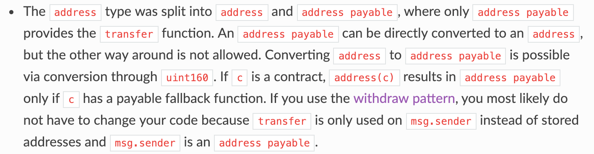
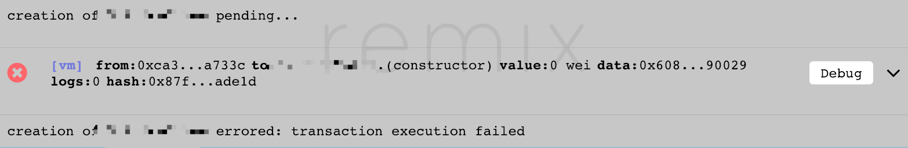

### address vs address payable

在 solidity 5.0 版本之后，address 被拆分成 address 和 address payable


在 5.0 之后，address 将失去`transfer`功能，得声明成 address payable 才有

> msg.sender 是一个 address payable

<!-- More -->

### address 转 address payable

```sol
address addr = xxx;
address payable addr1 = address(uint160(addr))
```

### address payable 转 address

```sol
address payable addr = xxx;
address addr1 = address(addr);
```

### 合约支持接收 eth

要使合约支持接收 eth 转账，需要声明 payable 函数，例如回退函数

```sol
function() external payable {
}
```

> !!! 如果合约支持接收 eth，那么最好声明对应的提取 eth 函数，例如

```sol
function withdraw() external {
    require(msg.sender == owner);
    msg.sender.transfer(address(this).balance);
}
```

### payable 测试

可以在 remix 上测试 payable 函数，填入 Value 数值调用即可


### ERC20 规范

decimals 需要先声明为 uint8，再强转成 uint256，例如定义 500w 总量

```sol
uint8 public constant decimals = 18;
uint256 public totalSupply = 5000000 * (10 ** uint256(decimals));
```

### gas 不足

当合约代码中存在的操作越来越多，对应的 gas 消耗也会越来越多（具体可以看官方的 gas 计算方式），那么在部署或者进行函数调用时，可能会出现失败的情况

例如在 remix 部署合约时出现


这些情况都可能是设定的 gas limit 过低，需要消耗的 gas 超过了 limit 导致调用失败，遇到这种情况都可以通过上调 gas 支出解决
