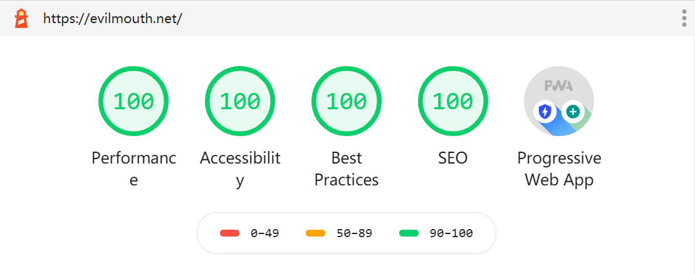

没错，最近将博客从 Hexo 迁移到 Gatsby 了，为什么要迁移，有许多原因

- 喜欢折腾
- 最近将所有编辑器改成亮色，据说暗色亮色切换看（编译器和浏览器）容易加深散光，那博客也换吧
- 既然折腾起来了，那干脆试下 Gatsby（前段时间了解到）
- Gatsby 相比 Hexo 简洁太多
- 看到上面那张图了吗，Gatsby 很看重 Lighthouse
- Gatsby 用的 React，顺便也学学 React

还有一点，博客路径也改了，从 blog.evilmouth.net 改成 evilmouth.net/blog，为什么

前段时间把网站迁移到 Github Pages，用 CNAME 记录到域名，博客用的 blog.evilmouth.net，指向 github.io，重点来了，我手机用的联通 4G，访问 github.io 是直接无法访问此网站，在网上看到别人也在讨论，说他们移动电信也是这样，实在是太坑了。不过联通没有禁止 github.com，所以 evilmouth.net 是可以访问的，就跟不留学的时候 git clone 半天是一样的，浏览还是给你看的。。。所以干脆将个人主页和博客放到一起，用 Gatsby 加两个页也是非常容易

看透太多，把以前用 Hexo Next 各种插件都干掉了，什么阅读量、评论、头像、乱七八糟一堆功能都干掉，就留下文章，瞬间看起来就舒服好多
