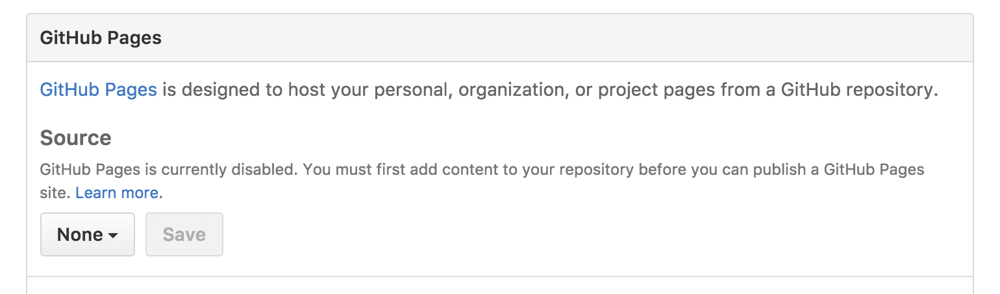
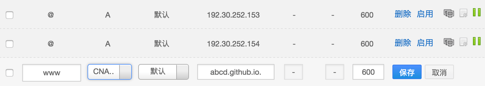

记录一下通过 Hexo 搭载个人博客过程，不得不说 Hexo 真的强大。

官方文档
[https://hexo.io/zh-cn/docs/index.html](https://hexo.io/zh-cn/docs/index.html)

<!-- More -->

## 安装前提

系统环境必须有 Node 和 Git

- [https://nodejs.org/zh-cn/](https://nodejs.org/zh-cn/)
- [https://git-scm.com/](https://git-scm.com/)

## 安装 Hexo

```shell
$ npm install -g hexo-cli
```

没有 npm 可以使用 HomeBrew 安装，很强大的工具（mac）
[https://brew.sh/](https://brew.sh/)

## 初始化

安装完 Hexo 后需要 init 一下并创建本地 blog 文件夹

下面的`<folder>`随意换成自己想要的文件夹名，如 blog

```shell
$ hexo init <folder>
$ cd <folder>
$ npm install
```

运行后可以在根目录找到<folder>文件夹，里面目录大概如下

```none
.
├── _config.yml
├── package.json
├── scaffolds
├── source
|   ├── _drafts
|   └── _posts
└── themes
```

## 验证是否配置成功

```shell
$ hexo s
```

运行后可以看到命令行

```shell
INFO  Start processing
INFO  Hexo is running at http://localhost:4000/. Press Ctrl+C to stop.
```

打开链接能正常显示就算配置成功了

## Github Pages Or Coding Pages

接下来就是网站部署了，这样别人就可以访问

### 前提

- 需要配置 ssh 管理密匙，比较推荐使用这种方式，也可以使用普通的 https，还没配置 ssh 的话可以参考这个
  [https://blog.zyhang.com/git-ssh-mac/](https://blog.zyhang.com/git-ssh-mac/)
- 需要给 Hexo 安装个 Git 插件

```shell
$ npm install hexo-deployer-git --save
```

### 第一个选择 部署到 Github Pages

部署到 Github 是个不错的选择，免费且有 300MB 空间，正常博客够用的，不过是国外的，访问速度可能有点慢

#### 创建仓库

这里要注意下，仓库名必须是唯一的，例如你的用户名是 abcd，那么创建的仓库名必须为 abcd.github.io。点击 Create repository。


#### 创建 Github Pages

进入仓库设置，拉到下面看到 Github Pages

可以看到上图 save 点不了，要求你的仓库起码有点内容，这时候返回仓库首页随便创建一下 README 就行了，因为后面 git 博客内容不会管其它文件的。

再回到仓库设置，选择主分支，并 Save

这时候会多出一栏文字

```shell
Your site is ready to be published at http://abcd.github.io/.
```

就可以通过这个网址访问了

#### 配置\_config.xml

打开刚才初始化时的文件夹根目录下的\_config.xml 文件，并修改 deploy 下属性，abcd 改为你的 Github 用户名

```yaml
deploy:
  type: git
  repo:
    github: git@github.com:abcd/abcd.github.io.git
  branch: master
```

#### 部署

```shell
$ hexo d -g
```

部署成功后使用刚才 Github Pages 地址就可以访问你的博客了。

### 第二个选择 部署到 Coding Pages

也可以部署到 Coding，毕竟国内，而且项目可以设置私有，避免泄露某些重要 key

#### 创建仓库

同样先创建仓库，注意仓库名也必须是唯一的：abcd.coding.me，abcd 是你的用户名


#### 创建 Coding Pages

来到->代码->Pages 服务，选择来源 master 主分支并保存

可以看到已经成功运行


#### 配置\_config.xml

打开刚才初始化时的文件夹根目录下的\_config.xml 文件，并修改 deploy 下属性，abcd 改为你的 Coding 用户名，可以看到 github 被注释掉了，如果想同时部署到多个仓库，就可以采用这种方式

```yaml
deploy:
  type: git
  repo:
    # github: git@github.com:abcd/abcd.github.io.git
    coding: git@git.coding.net:abcd/abcd.coding.me.git
  branch: master
```

#### 部署

```shell
$ hexo d -g
```

同样部署成功后使用刚才 Coding Pages 地址就可以访问你的博客了。

## 博客配置

部署的博客上面有些信息是默认的，比如博客名称作者名称等等，肯定需要改成自己的，可以参考
[http://theme-next.iissnan.com/getting-started.html(http://theme-next.iissnan.com/getting-started.html)

这是个人比较喜欢的主题 NexT，官网也有很多很好的主题，自行选择。

## 进阶-绑定域名

首先需要一个域名，GoDaddy、万网、新网都可以，建议还是买比较好的域名，毕竟有些域名备不了案。我是在万网买的域名 zyhang.com，一年貌似几十块钱，非常便宜

### 设置 DNS 服务器

这里建议选择 DNSPod，不过也可以用万网自己的。进入万网控制台，并修改 DNS 服务器为


- f1g1ns1.dnspod.net
- f1g1ns2.dnspod.net

### 解析

如果选择了 DNSPod，那就要去 DNSPod 进行解析了。[DNSPod 入口](https://www.dnspod.cn/)

#### 添加域名

进入 DNSPod，进入域名解析并添加域名


#### 添加解析记录

可以解析到 Github 也可以解析到 Coding 也可以都解析

##### 解析到 Github

- 解析到 Github 需要注意一点，就是需要在`<folder>`目录下的`source`目录里新建个文件 CNAME 并在文件里面添加一行你的域名，我这里是 zyhang.com,如果不想解析到主域名，这里也可以写成类似 blog.zyhang.com 等等，记得重新 git 到 Github 上
  
- 继续到 DNSPod 添加解析记录，添加以下三项，域名解析有时候得等一会，稍后就可以使用你的域名访问网站了
  

##### 解析到 Coding

- 解析到 Coding 不需要像 Github 一样新建个 CNAME 文件，只需要直接到项目控制台->代码->Pages 服务->自定义域名，填写你的域名进行绑定就可以了
  
- 然后依然是到 DNSPod 添加解析记录，添加以下两项即可
  

至此自定义域名绑定成功
