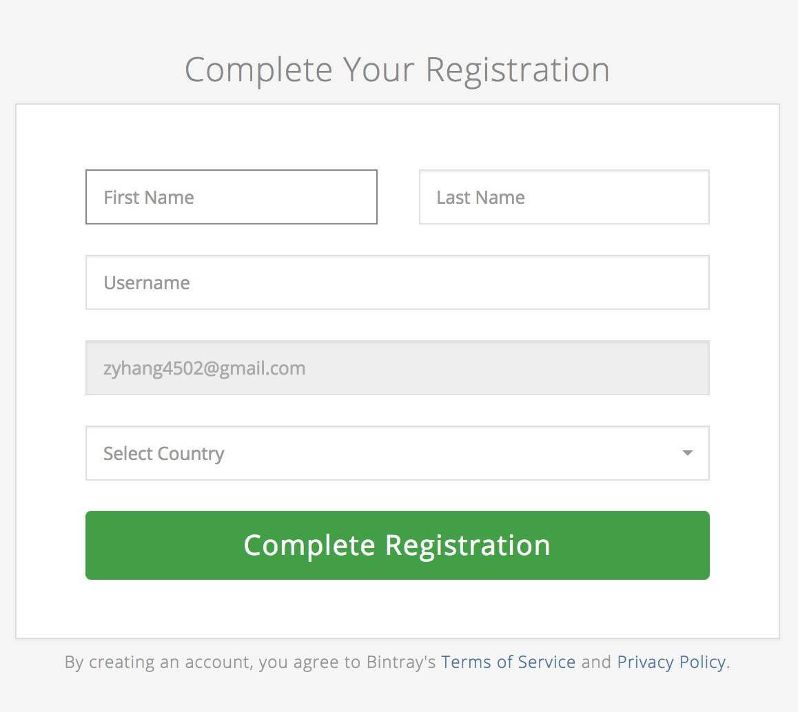
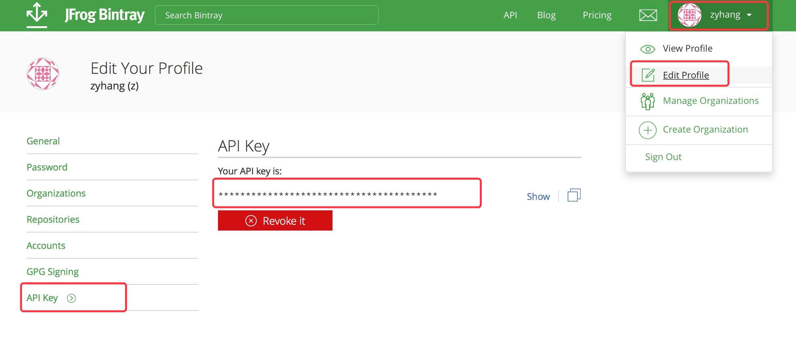
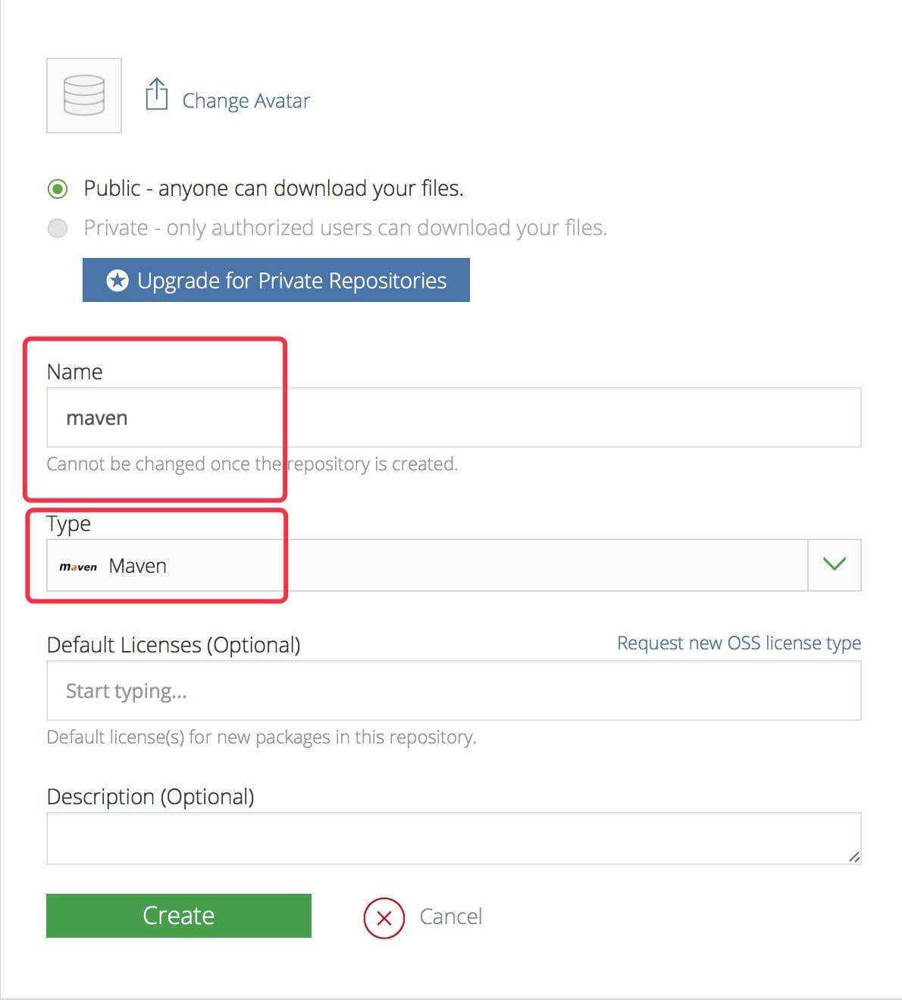
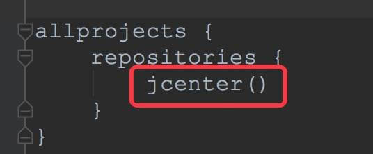

记录一下`Android`开发发布项目到`jcenter`的过程

Android开发过程中需要拉很多依赖，比如官方的库，通常都是一句话调用，非常方便


之前也使用过`jitPack`，比起`jcenter`方便很多，不过使用的人没有用`jcenter`的多，新建Android项目也不会自己配置，如果你想用`jitPack`，可以看这篇文章[上传项目到jitpack](http://zyhang.com/2017/05/08/maven-jitpack/)

<!-- More -->

那么现在开始配置

## 创建bintray账号
[https://bintray.com/signup/oss](https://bintray.com/signup/oss)
要发布到`jcenter`需要有个`bintray`账号管理你的仓库，上面是注册链接。注意这一步非常关键，因为你如果直接搜`bintray`跳去官网首页并注册的话是注册企业账号，是只有30天试用而且后续操作也会不同，所以千万注意要注册的是个人账号。
点链接进去之后选`Sign up with Github`用`Github`账号注册就好了，这里填写注册资料，里面的`Username`比较重要，关乎后面项目的配置

注册完之后直接会跳到首页，这里还需要记住API key信息，也关乎后面项目配置。可以在个人资料页里面找到


## 创建Repository
在bintray网站首页找到`Add New Repository`创建仓库，注意`Name`和`Type`（其中的`Name`不一定要起`maven`）


## 添加插件
为根目录的`build.gradle`的`dependencies`添加`bintray`插件
```
classpath 'com.jfrog.bintray.gradle:gradle-bintray-plugin:1.7.3'
classpath 'com.github.dcendents:android-maven-gradle-plugin:1.5'
```

## 修改module
修改你想发布的`library`级别的module的`build.gradle`，直接在后面添加如下代码
```
ext {
    bintrayRepo = 'maven'//上面创建`Repository`的是`Name`
    bintrayName = 'damon'//你想要发布的仓库的名称

    publishedGroupId = 'com.zyhang'//groupId，跟下面的artifact组合
    artifact = 'damon'//artifact，跟上面的groupId组合，到时候别人拉依赖就是`compile 'com.zyhang:damon:1.0.0'`

    siteUrl = 'https://github.com/izyhang/Damon'//项目地址
    gitUrl = 'https://github.com/izyhang/Damon.git'//项目git地址

    libraryVersion = '1.0.0'//版本号
    libraryName = 'Damon'//名称
    libraryDescription = 'a android mvp framework based on rxjava rxlifecycle'//介绍

    developerId = 'zyhang'//开发者id
    developerName = 'zyhang'//开发者名称
    developerEmail = 'zyhang4502@gmail.com'//开发者邮箱

    //以下不用改动
    licenseName = 'The Apache Software License, Version 2.0'
    licenseUrl = 'http://www.apache.org/licenses/LICENSE-2.0.txt'
    allLicenses = ["Apache-2.0"]
}

//这两句是编译上传配置
apply from:'../gradle/install.gradle'
apply from:'../gradle/bintray.gradle'
```

## 配置用户信息和API key
打开项目的`local.properties`文件并增加
```
bintray.user=zyhang//刚才`Username
bintray.apikey=*********************************//刚才的API key
```

## 编译上传配置
在项目的`gradle`文件夹新建两个文件`install.gradle`和`bintray.gradle`，其内容如下

`install.gradle`
```
apply plugin: 'com.github.dcendents.android-maven'

group = publishedGroupId                               // Maven Group ID for the artifact

install {
    repositories.mavenInstaller {
        // This generates POM.xml with proper parameters
        pom {
            project {
                packaging 'aar'
                groupId publishedGroupId
                artifactId artifact

                // Add your description here
                name libraryName
                description libraryDescription
                url siteUrl

                // Set your license
                licenses {
                    license {
                        name licenseName
                        url licenseUrl
                    }
                }
                developers {
                    developer {
                        id developerId
                        name developerName
                        email developerEmail
                    }
                }
                scm {
                    connection gitUrl
                    developerConnection gitUrl
                    url siteUrl
                }
            }
        }
    }
}
```

`bintray.gradle`
```
apply plugin: 'com.jfrog.bintray'

version = libraryVersion

task sourcesJar(type: Jar) {
    from android.sourceSets.main.java.srcDirs
    classifier = 'sources'
}

artifacts {
    archives sourcesJar
}

android.libraryVariants.all { variant ->
    println variant.javaCompile.classpath.files
    if(variant.name == 'release') {
        task("generate${variant.name.capitalize()}Javadoc", type: Javadoc) {
            // title = ''
            // description = ''
            source = variant.javaCompile.source
            classpath = files(variant.javaCompile.classpath.files, project.android.getBootClasspath())
            options {
                encoding "utf-8"
                links "http://docs.oracle.com/javase/7/docs/api/"
                linksOffline "http://d.android.com/reference", "${android.sdkDirectory}/docs/reference"
            }
            exclude '**/BuildConfig.java'
            exclude '**/R.java'
        }
        task("javadoc${variant.name.capitalize()}Jar", type: Jar, dependsOn: "generate${variant.name.capitalize()}Javadoc") {
            classifier = 'javadoc'
            from tasks.getByName("generate${variant.name.capitalize()}Javadoc").destinationDir
        }
        artifacts {
            archives tasks.getByName("javadoc${variant.name.capitalize()}Jar")
        }
    }
}

// Bintray
Properties properties = new Properties()
properties.load(project.rootProject.file('local.properties').newDataInputStream())

bintray {
    user = properties.getProperty("bintray.user")
    key = properties.getProperty("bintray.apikey")

    configurations = ['archives']
    pkg {
        repo = bintrayRepo
        name = bintrayName
        desc = libraryDescription
        websiteUrl = siteUrl
        vcsUrl = gitUrl
        licenses = allLicenses
        publish = true
        publicDownloadNumbers = true
        version {
            desc = libraryDescription
            gpg {
                sign = true //Determines whether to GPG sign the files. The default is false
                passphrase = properties.getProperty("bintray.gpg.password")
                //Optional. The passphrase for GPG signing'
            }
        }
    }
}
```

## 上传
配置完成，准备上传到`bintray`
直接使用`Android Studio`的`Terminal`
```
./gradlew install
./gradlew bintrayupload
```

如果遇到`permission denied: ./gradlew`
可以先执行`chmod +x gradlew`

等待编译成功出现SUCCESS，这时候再上`bintray`就可以在刚才创建的`Repository`找到你的`library`


## 添加到jcenter
虽然现在你的`library`已经发布了，但是也只是发布在你个人的`Maven`仓库中，如果别人要添加此依赖，还必须定义你的仓库的地址，如下
```
repositories {
    maven {
        url  "http://dl.bintray.com/zyhang/maven"//此地址可以在`package`页的`SET ME UP`里面找到
    }
}

...

dependencies {
    compile 'com.zyhang:damon:1.0.0'
}
```
但是这样就与我们的预期不一致了，我们是想要一句话直接调用，不需要再去定义什么仓库地址，所以此时你只需要同步你的仓库到`jcenter`就行了

然后提交坐等`approved`就可以了，第二天就会收到邮件，现在就可以直接一句话拉依赖了


## 总结
之所以配置到`jcenter`能够使别人一句话拉依赖其实也是因为使用`jcenter`的人是最多的，所以谷歌也直接帮我们自动配置了`jcenter`，在使用`Android Studio`新建项目的时候就可以看到

