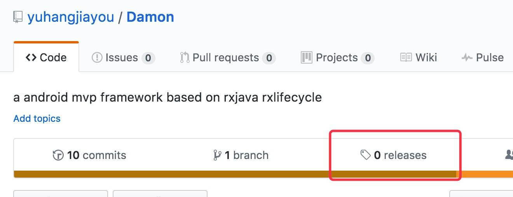
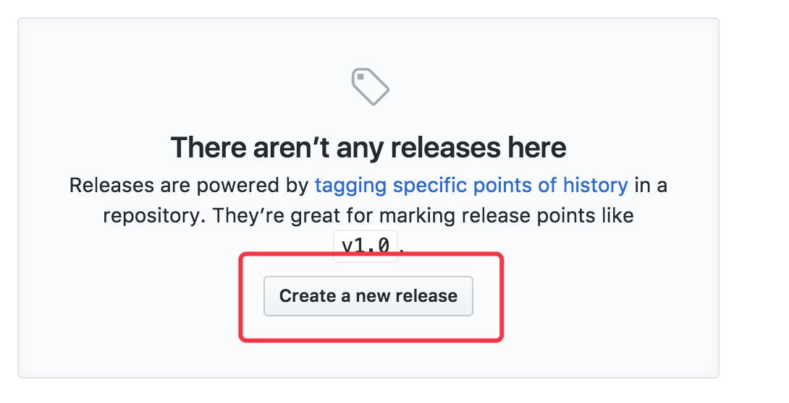
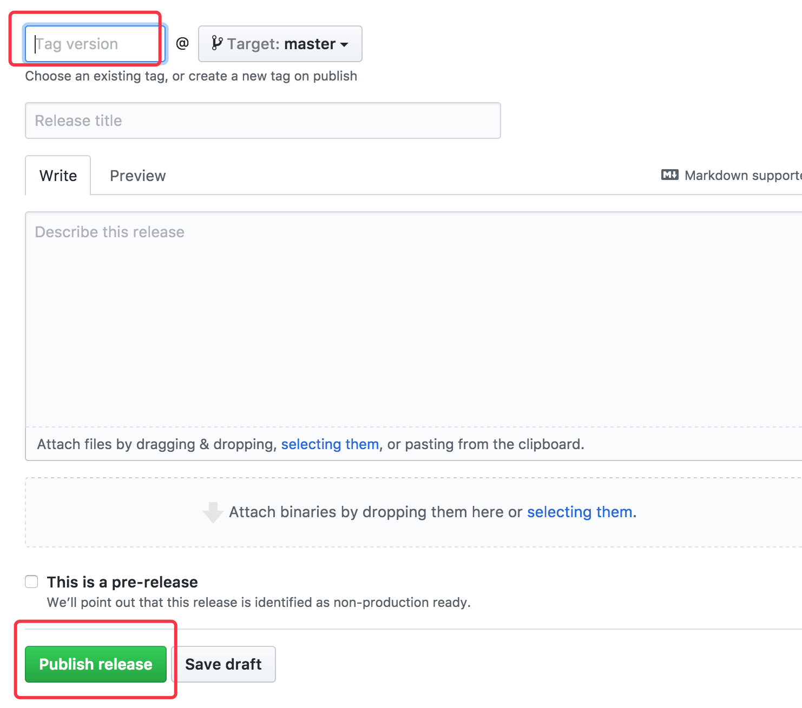

需要发布个人仓库方便其他项目使用，最容易的方法估计也就是`jitpack`了

`jitpack`官网其实就有教程[https://jitpack.io/docs/ANDROID/](https://jitpack.io/docs/ANDROID/)

<!-- More -->

## 添加 maven 插件

在根`build.gradle`配置插件

```groovy
buildscript {
  dependencies {
    classpath 'com.github.dcendents:android-maven-gradle-plugin:1.5' // Add this line
```

## 配置 library

在`library`的`build.gradle`添加

```groovy
apply plugin: 'com.github.dcendents.android-maven'

 group='com.github.YourUsername'
```

## 创建一个 release

为你的`Github`仓库创建一个`release`




## 拉依赖

```groovy
allprojects {
 repositories {
    jcenter()
    maven { url "https://jitpack.io" }
 }
}
```

最后

```groovy
dependencies {
    compile 'com.github.YourUsername:YourProjectName:YourProjectVersion'
}
```
